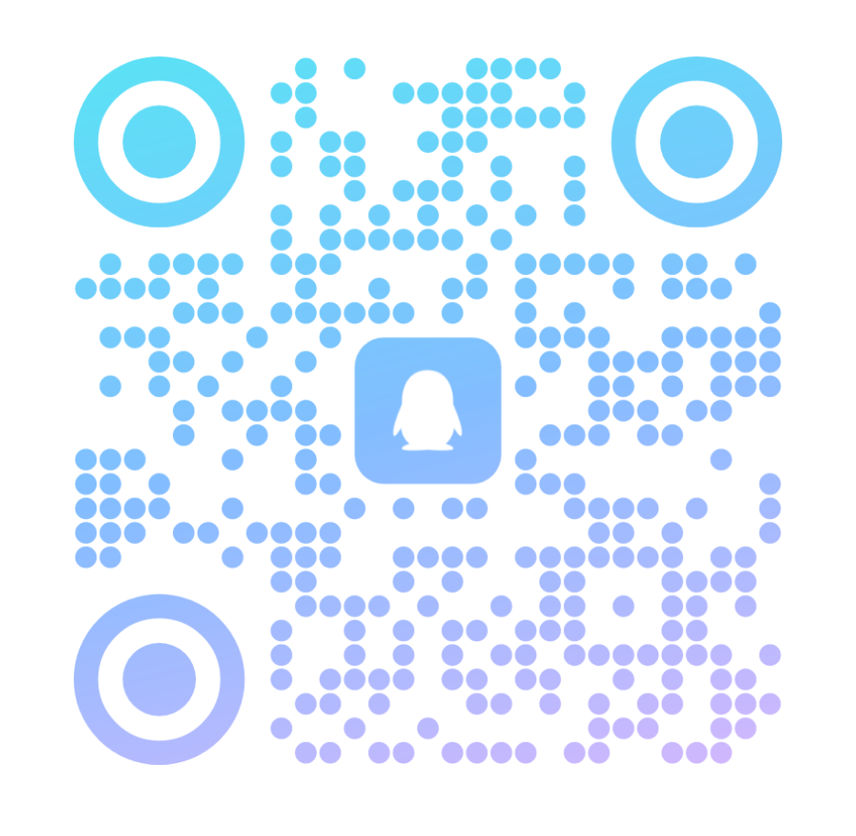

# IOTWave

[English](README_EN.md) | 中文

一个基于 .NET 8.0 和 .NET 10 的 IoT 框架库，提供高性能的波形显示和数据处理能力。

## 特性

- 多框架支持 (.NET 8.0 和 .NET 10.0)
- 基于 Avalonia UI 的高性能波形显示控件
- 支持 TimeMarker、TimeRangeMarker、YMarker 等标记功能
- 可自定义的 Y 轴渲染器
- 支持缩放、平移等交互操作
- 可扩展的架构设计

## 安装

通过 NuGet 安装：

```bash
dotnet add package IOTWave
```

## 快速开始

```csharp
using IotWave.Views;
using IotWave.Models;

// 创建 WaveListPanel
var wavePanel = new WaveListPanel
{
    StartTime = DateTime.Now.AddHours(-1),
    EndTime = DateTime.Now,
    AutoDistributePanelHeight = true
};

// 添加曲线数据
wavePanel.ItemsSource = curveGroups;
```

## 项目结构

```
IOTWave/
├── IOTWave/                 # 核心库
│   ├── Views/              # Avalonia UI 控件
│   ├── Models/             # 数据模型
│   └── ...
├── IOTWaveDemo/            # 演示项目
├── IOTWave.Tests/          # 单元测试
└── Doc/                    # 文档
```

## 许可证

本项目采用 LGPL-2.1-or-later 许可证 - 详见 [LICENSE](LICENSE) 文件。

## 贡献

欢迎贡献！请随时提交 Pull Request。

## 联系方式

- 邮箱: jionfull@163.com
- QQ: 2608902246

<div align="center">
  <table>
    <tr>
      <td align="center">
        
        <br/>
        <sub>QQ 二维码</sub>
      </td>
    
    </tr>
  </table>
</div>

## Star History

如果这个项目对你有帮助，请给一个 ⭐️ Star！
